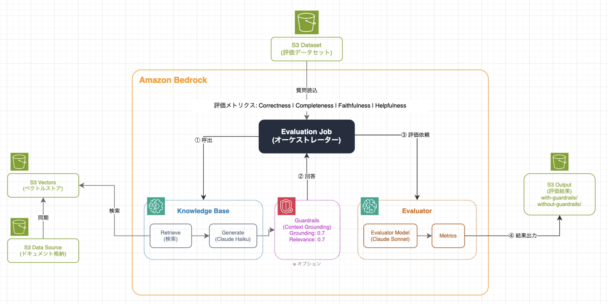

# Amazon Bedrock RAG 評価フレームワーク - Guardrails コンテキストグラウンディング評価

Amazon Bedrock Evaluations を使用して、Knowledge Bases への Guardrails（コンテキストグラウンディング）適用による**ハルシネーション防止の有効性**を評価した作業の記録です

## 機能

- AWS CDK（TypeScript）による自動インフラデプロイ
- S3 Vectors をベクトルストアとして使用した Knowledge Base
- ハルシネーション防止のための Guardrails コンテキストグラウンディング設定
- Guardrails あり/なしを比較する評価ジョブのセットアップ
- LLM 分析オプション付きレポート生成スクリプト

## 概要

このリポジトリは、RAG（Retrieval-Augmented Generation）システムにおいて、Guardrails のコンテキストグラウンディング機能がハルシネーション防止にどの程度効果があるかを定量的に評価します。

### 評価内容

- **Guardrails なし**と**Guardrails あり**の2パターンで評価ジョブを実行
- 4つのメトリクス（Correctness, Completeness, Faithfulness, Helpfulness）でスコアを比較
- 特に **Faithfulness（忠実性）** メトリクスでハルシネーション回避度を評価

### 主要コンポーネント

| コンポーネント | 説明 |
|---------------|------|
| **Knowledge Base** | S3 Vectors をベクトルストアとして使用 |
| **Guardrails** | コンテキストグラウンディングによるハルシネーション防止 |
| **評価ジョブ** | Guardrails あり/なしで応答品質を比較評価 |

## アーキテクチャ



### データフロー

1. **同期フェーズ**: S3 Data Source → S3 Vectors（ドキュメントをベクトル化）
2. **評価フェーズ**:
   - Evaluation Job が S3 Dataset から質問を読み込み
   - Knowledge Base で検索・回答生成
   - Guardrails でハルシネーションチェック（あり/なしの2パターン）
   - 結果を S3 Output に出力

## CDK で作成されるリソース

| # | リソース | 名前 |
|---|----------|------|
| 1 | S3（データソース） | `bedrock-rag-eval-guardrails-grounding-datasource-{アカウントID}` |
| 2 | S3（評価出力） | `bedrock-rag-eval-guardrails-grounding-output-{アカウントID}` |
|   | └ サブフォルダ | `with-guardrails/`, `without-guardrails/` |
| 3 | S3（評価データセット） | `bedrock-rag-eval-guardrails-grounding-dataset-{アカウントID}` |
| 4 | S3 Vector Bucket | `bedrock-rag-eval-guardrails-grounding-vector-store-{アカウントID}` |
| 5 | S3 Vector Index | `bedrock-rag-eval-guardrails-grounding-index` |
| 6 | Knowledge Base | `bedrock-rag-eval-guardrails-grounding-kb` |
| 7 | Data Source | KB に紐づく |
| 8 | Guardrails | `bedrock-rag-eval-guardrails-grounding-guardrail` |
| 9 | IAM ロール（KB用） | `bedrock-rag-eval-guardrails-grounding-kb-role` |
| 10 | IAM ロール（評価用） | `bedrock-rag-eval-guardrails-grounding-eval-role` |

---

## 前提条件

- AWS CLI がインストールされ、認証情報が設定されていること
- Node.js 18.x 以上
- pnpm がインストール済み
- AWS CDK CLI がインストール済み

```bash
npm install -g aws-cdk
```

---

## セットアップ手順

### 1. リポジトリのクローン・移動

```bash
git clone https://github.com/your-repo/bedrock-rag-eval-guardrails-grounding.git
cd bedrock-rag-eval-guardrails-grounding/cdk
```

### 2. 依存関係のインストール

```bash
pnpm install
```

### 3. CDK ブートストラップ（初回のみ）

```bash
pnpm cdk bootstrap
```

### 4. デプロイ

```bash
pnpm cdk deploy
```

### 5. デプロイ確認

デプロイ完了後、以下の Output が表示されます：

| Output | 説明 |
|--------|------|
| DataSourceBucketName | ドキュメント格納用 S3 バケット |
| EvaluationOutputBucketName | 評価結果出力用 S3 バケット |
| EvaluationDatasetBucketName | 評価データセット用 S3 バケット |
| VectorBucketName | ベクトルストア用 S3 バケット |
| KnowledgeBaseId | Knowledge Base ID |
| DataSourceId | Data Source ID |
| GuardrailId | Guardrail ID |
| GuardrailVersionOutput | Guardrail バージョン |
| KnowledgeBaseRoleArn | KB 用 IAM ロール ARN |
| EvaluationRoleArn | 評価ジョブ用 IAM ロール ARN |

---

## サンプルデータのアップロード

### ドキュメントのアップロード

```bash
aws s3 cp sample_data/product_manual.txt s3://bedrock-rag-eval-guardrails-grounding-datasource-{アカウントID}/
```

### 評価データセットのアップロード

```bash
aws s3 cp sample_data/evaluation_dataset.jsonl s3://bedrock-rag-eval-guardrails-grounding-dataset-{アカウントID}/
```

---

## Knowledge Base の同期

### コンソールから同期

1. [Amazon Bedrock コンソール](https://console.aws.amazon.com/bedrock/) を開く
2. **ナレッジベース** → `bedrock-rag-eval-guardrails-grounding-kb` を選択
3. **データソース** セクションで `bedrock-rag-eval-guardrails-grounding-datasource` を選択
4. **同期** ボタンをクリック
5. 同期完了を待つ（ステータスが「Available」になる）

### CLI から同期（代替）

```bash
aws bedrock-agent start-ingestion-job \
  --knowledge-base-id {KnowledgeBaseId} \
  --data-source-id {DataSourceId} \
  --region ap-northeast-1
```

---

## 評価ジョブの作成（コンソールから実施）

### 評価データセットの形式

評価データセットは `conversationTurns` 形式の JSONL ファイルです。

```jsonl
{"conversationTurns": [{"prompt": {"content": [{"text": "SmartHub X1の寸法を教えてください"}]}, "referenceResponses": [{"content": [{"text": "SmartHub X1の寸法は120mm x 120mm x 35mmです。"}]}]}]}
{"conversationTurns": [{"prompt": {"content": [{"text": "SmartHub X1は最大何台のデバイスに対応していますか？"}]}, "referenceResponses": [{"content": [{"text": "SmartHub X1は最大100台のデバイスに対応しています。"}]}]}]}
```

---

### 評価ジョブの作成（Guardrails なし）

1. [Amazon Bedrock コンソール](https://console.aws.amazon.com/bedrock/) を開く
2. **評価** → **モデル評価** → **評価を作成** をクリック
3. 以下を設定：

| 項目 | 設定値 |
|------|--------|
| 評価タイプ | Knowledge Base evaluation |
| 評価名 | `eval-without-guardrails` |

4. **Inference source** セクション：

| 項目 | 設定値 |
|------|--------|
| Select source | Bedrock Knowledge Base |
| Knowledge Base | `bedrock-rag-eval-guardrails-grounding-kb` |
| Evaluation type | Retrieval and response generation |
| Response generator model | Claude 3 Haiku |

5. **Metrics** セクション（4つ選択）：

| メトリクス | 説明 | 選択 |
|-----------|------|------|
| Helpfulness | 応答の有用性 | ✅ |
| Correctness | 応答の正確性 | ✅ |
| Faithfulness | ハルシネーション回避度 | ✅ |
| Completeness | 回答の完全性 | ✅ |

6. **Dataset** セクション：

| 項目 | 設定値 |
|------|--------|
| データセットの場所 | `s3://bedrock-rag-eval-guardrails-grounding-dataset-{アカウントID}/evaluation_dataset.jsonl` |
| 出力先 | `s3://bedrock-rag-eval-guardrails-grounding-output-{アカウントID}/without-guardrails/` |

7. **IAM role** セクション：

| 項目 | 設定値 |
|------|--------|
| サービスロール | `bedrock-rag-eval-guardrails-grounding-eval-role` を選択 |

8. **評価を作成** をクリック

---

### 評価ジョブの作成（Guardrails あり）

1. **評価** → **モデル評価** → **評価を作成** をクリック
2. 以下を設定：

| 項目 | 設定値 |
|------|--------|
| 評価タイプ | Knowledge Base evaluation |
| 評価名 | `eval-with-guardrails` |

3. **Inference source** セクション：

| 項目 | 設定値 |
|------|--------|
| Select source | Bedrock Knowledge Base |
| Knowledge Base | `bedrock-rag-eval-guardrails-grounding-kb` |
| Evaluation type | Retrieval and response generation |
| Response generator model | Claude 3 Haiku |

4. **configurations** をクリックして展開

5. **Guardrails** セクション：

| 項目 | 設定値 |
|------|--------|
| Name | `bedrock-rag-eval-guardrails-grounding-guardrail` |
| Version | `Version 1` |

6. **Metrics** セクション（4つ選択）：

| メトリクス | 選択 |
|-----------|------|
| Helpfulness | ✅ |
| Correctness | ✅ |
| Faithfulness | ✅ |
| Completeness | ✅ |

7. **Dataset** セクション：

| 項目 | 設定値 |
|------|--------|
| データセットの場所 | `s3://bedrock-rag-eval-guardrails-grounding-dataset-{アカウントID}/evaluation_dataset.jsonl` |
| 出力先 | `s3://bedrock-rag-eval-guardrails-grounding-output-{アカウントID}/with-guardrails/` |

8. **IAM role** セクション：

| 項目 | 設定値 |
|------|--------|
| サービスロール | `bedrock-rag-eval-guardrails-grounding-eval-role` を選択 |

9. **評価を作成** をクリック

---

## 評価結果の確認

### コンソールから確認

1. **評価** → **モデル評価** を開く
2. 作成した評価ジョブを選択
3. ステータスが「Completed」になったら結果を確認

### S3 から確認

```bash
# Guardrails なし
aws s3 ls s3://bedrock-rag-eval-guardrails-grounding-output-{アカウントID}/without-guardrails/ --recursive

# Guardrails あり
aws s3 ls s3://bedrock-rag-eval-guardrails-grounding-output-{アカウントID}/with-guardrails/ --recursive
```

---

## 評価結果レポートの生成

S3 に出力された評価結果を集計し、Markdown レポートを生成します。

### スクリプトの実行

```bash
python scripts/generate_report.py \
  --account-id {アカウントID} \
  --output 評価結果.md
```

### オプション

| オプション | 説明 |
|-----------|------|
| `--account-id` | AWS アカウント ID（必須） |
| `--output` | 出力ファイル名（デフォルト: 評価結果.md） |
| `--use-llm` | LLM（Claude）で分析コメントを追加 |
| `--kb-id` | Knowledge Base ID（レポート用） |
| `--guardrail-id` | Guardrail ID（レポート用） |

### LLM 分析付きで実行

```bash
python scripts/generate_report.py \
  --account-id {アカウントID} \
  --use-llm \
  --kb-id {KnowledgeBaseId} \
  --guardrail-id {GuardrailId} \
  --output 評価結果.md
```

### 出力されるレポートの内容

| セクション | 内容 |
|-----------|------|
| 評価設定 | テストケース数、モデル情報 |
| 評価スコア比較 | Guardrails あり/なしの平均スコア比較 |
| 質問別の詳細結果 | 各質問のメトリクス一覧 |
| 差が大きかった質問の分析 | 回答の比較 |
| 結論 | 総合評価 |

---

## 評価メトリクス

| メトリクス | 説明 |
|-----------|------|
| **Correctness** | 応答の正確性（期待される回答との一致度） |
| **Completeness** | 回答の完全性（必要な情報がすべて含まれているか） |
| **Faithfulness** | 忠実性（ソースドキュメントに基づいているか、**ハルシネーション回避度**） |
| **Helpfulness** | 有用性（ユーザーにとって役立つ回答か） |

---

## ディレクトリ構成

```
bedrock-rag-eval-guardrails-grounding/
├── cdk/
│   ├── bin/
│   │   └── app.ts              # CDK エントリーポイント
│   ├── lib/
│   │   └── main-stack.ts       # 全リソースを含むスタック
│   ├── package.json
│   └── tsconfig.json
├── sample_data/
│   ├── product_manual.txt      # サンプルドキュメント
│   └── evaluation_dataset.jsonl # 評価用データセット
├── scripts/
│   └── generate_report.py      # 評価結果レポート生成
├── images/                     # ドキュメント用画像
├── README.md                   # 英語版ドキュメント
└── README.ja.md                # 日本語版ドキュメント
```

---

## クリーンアップ

```bash
cd cdk
pnpm cdk destroy
```

> **注意**: S3 バケット内のオブジェクトも自動削除されます（`auto_delete_objects=True`）。

---

## 参考リンク

- [Amazon S3 Vectors](https://docs.aws.amazon.com/AmazonS3/latest/userguide/s3-vectors.html)
- [Amazon Bedrock Knowledge Bases](https://docs.aws.amazon.com/bedrock/latest/userguide/knowledge-base.html)
- [Amazon Bedrock Guardrails - Contextual Grounding](https://docs.aws.amazon.com/bedrock/latest/userguide/guardrails-contextual-grounding-check.html)
- [Amazon Bedrock Model Evaluation](https://docs.aws.amazon.com/bedrock/latest/userguide/model-evaluation.html)

---

## ライセンス

MIT License
